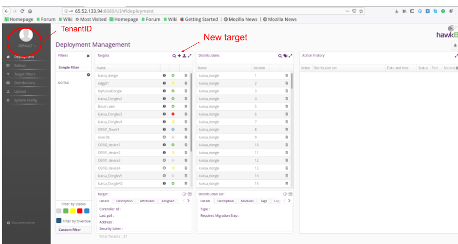
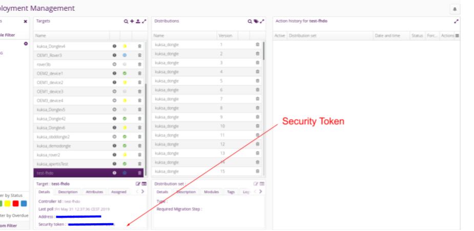
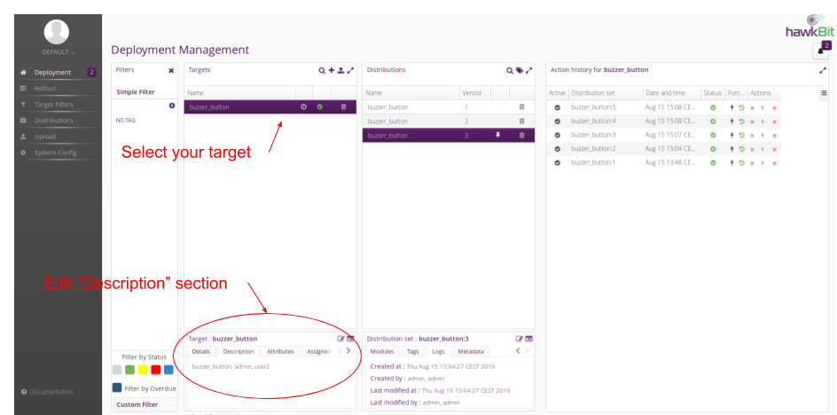
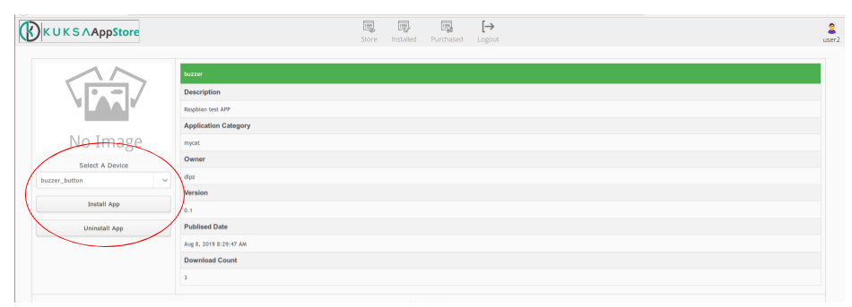

This tutorial will guide you step by step on how to upload your own rover application to Kuksa Appstore, and download any application from the Appstore to the Raspberry Pi. 

# Upload your rover application to Appstore
There are four main steps in this part.

1. Create Docker image
2. Run Kuksa-app-manager 
3. create target in Hawkbit
4. Upload your app using kuksa-app-publisher

## Creating your Docker image
1. Install Docker in Raspbian.

```
$ sudo apt-get install apt-transport-https ca-certificates software-properties-common -y
$ curl -fsSL get.docker.com -o get-docker.sh && sh get-docker.sh
$ sudo groupadd docker
$ sudo gpasswd -a $USER docker
```

2. Check if docker was installed. 

```
$ docker run hello-world
```

If Docker is installed properly, you'll see a "Hello from Docker!" message.


3. Clone this [repository](https://github.com/app4mc-rover/rover-example-app)

```
$ git clone https://github.com/app4mc-rover/rover-example-app.git
$ cd rover-example-app/
```

4. To build applications based on RoverAPI, you should use the following syntax:

```
$ docker build -f <example-dir>/Dockerfile -t <image-name:tag> .
```

In our case we will use the **buzzer** example. 

```
$ docker build -f buzzer_button_example/Dockerfile -t buzzer .
```

**Note**: If the tag is not specified such as "buzzer:0.1", the default is `latest`.

5. To deploy your application on the Rover, you should run the container using the following syntax:

```
$ docker run --privileged -v /var/run/systemd:/var/run/systemd -v /dev/video0:/dev/video0 -v /lib/modules:/lib/modules <image-name:tag>
```

Using **buzzer** example: 
```
$ docker run --privileged -v /var/run/systemd:/var/run/systemd -v /dev/video0:/dev/video0 -v /lib/modules:/lib/modules buzzer
```


## Creating a target in Hawkbit

1. Clone the kuksa.invehicle repository

```
$ git clone https://github.com/eclipse/kuksa.invehicle.git
$ cd kuksa.invehicle/kuksa-appmanager/
```

2. Check if you have python3.5 or higher installed.

```sh
$ ls -l /usr/bin/python*
lrwxrwxrwx 1 root root       9 May  8  2018 /usr/bin/python -> python2.7
lrwxrwxrwx 1 root root       9 Jan 24  2017 /usr/bin/python2 -> python2.7
-rwxr-xr-x 1 root root 3166320 Sep 26  2018 /usr/bin/python2.7
lrwxrwxrwx 1 root root      36 Sep 26  2018 /usr/bin/python2.7-config -> arm-linux-gnueabihf-python2.7-config
lrwxrwxrwx 1 root root      16 Jan 24  2017 /usr/bin/python2-config -> python2.7-config
lrwxrwxrwx 1 root root       9 Jan 20  2017 /usr/bin/python3 -> python3.5
-rwxr-xr-x 2 root root 3976256 Sep 27  2018 /usr/bin/python3.5
lrwxrwxrwx 1 root root      36 Sep 27  2018 /usr/bin/python3.5-config -> arm-linux-gnueabihf-python3.5-config
-rwxr-xr-x 2 root root 3976256 Sep 27  2018 /usr/bin/python3.5m
lrwxrwxrwx 1 root root      37 Sep 27  2018 /usr/bin/python3.5m-config -> arm-linux-gnueabihf-python3.5m-config
lrwxrwxrwx 1 root root      16 Jan 20  2017 /usr/bin/python3-config -> python3.5-config
lrwxrwxrwx 1 root root      10 Jan 20  2017 /usr/bin/python3m -> python3.5m
lrwxrwxrwx 1 root root      17 Jan 20  2017 /usr/bin/python3m-config -> python3.5m-config
lrwxrwxrwx 1 root root      16 Jan 24  2017 /usr/bin/python-config -> python2.7-config
```

If python3.5 or higher is not listed, install it. 

3. Check if you have pip3.5 or higher

```
$ ls -l /usr/bin/pip*
-rwxr-xr-x 1 root root   292 Feb 26  2018 /usr/bin/pip
-rwxr-xr-x 1 root root   292 Feb 26  2018 /usr/bin/pip2
-rwxr-xr-x 1 root root   293 Feb 26  2018 /usr/bin/pip3
lrwxrwxrwx 1 root root     4 Apr 18  2018 /usr/bin/pip-3.2 -> pip3
-rwxr-xr-x 1 root root 34760 Feb 18 13:06 /usr/bin/pipanel
```

If python3.5 or higher is not listed, install it. 

4. You will need to create a virtal environment in python.  Execute the following commands or follow a more detailed description [here](https://github.com/eclipse/kuksa.invehicle/blob/master/kuksa-appmanager/wiki/development.md).

Set-up the virtual environment. 

```
$ pip3 install virtualenvwrapper
$ mkdir ~/.virtualenvs
$ export WORKON_HOME=~/.virtualenvs
$ source `which virtualenvwrapper.sh`
$ source ~/.bashrc
$ cd  <your-path-to-kuksa-manager>
```

Create the virtual environment. 

```sh
$ mkvirtualenv -p `which python3` `basename $PWD`
(kuksa-appmanager) $ echo $PWD > $VIRTUAL_ENV/.project
```

5. To upload your application, you will need to run the kuksa appmanager. But first you need to install its dependencies.

Remove old packages to avoid conflicts with docker.  

```sh
$ pip3 uninstall docker-py
$ pip3 uninstall docker
```

Install kuksa appmanager dependencies. 

```sh
(kuksa-appmanager) $ pip3 install -r requirements.txt
```

5. Open your hawkbit UI `https://YOUR_HAWKBIT_SERVER_URL` using Firefox or Chrome, log in and create a new target as shown in the following figure. 



6. Setup Kuksa-appmanager environment variables, in order to link your Rover to the kuksa appmanager.

```sh 
$ export HAWKBIT_SERVER="http://YOUR_HAWKBIT_SERVER_URL"
$ export HAWKBIT_TENANT="YOUR_TENANT_ID"
$ export HAWKBIT_DEVICE="YOUR_DEVICE_NAME"
$ export HAWKBIT_TOKEN="DEVICE_TOKEN"
```



7. Start the app manager.

```sh
$ python -m kuksa.appmanager
```

## Publishing your application to KuksaAppstore

**Note**: A more detailed tutorial can be found [here](https://github.com/eclipse/kuksa.apps/tree/master/kuksa-app-publisher).

1. Clone the kuska.app repository.

```
$ git clone https://github.com/eclipse/kuksa.apps.git
$ cd kuksa.apps/kuksa-app-publisher/
```

2. You will need a yaml file `YOUR_APPLICATION_NAME.yaml` to upload your application. The basic structure is shown below:


```yaml
docker:
    image : "DOCKER_IMAGE:TAG"
    name : "YOUR_APPLICATION_NAME"
    version : "YOUR_APPLICATION_VERSION"
    owner : "YOUR_NAME"
    description : "YOUR_APPLICATION_DESCRIPTION"
    config :
        network_mode : "host"

appstore :
    url : "YOUR_KUKSA_APPSTORE_URL"
    category : "APPLICATION_CATEGORY"
    auth : "KUSKA_APPSTORE_AUTHENTICATION_KEY"

hawkbit :
    url : "YOUR_HAWKBIT_SERVER_URL" 
    target : "YOUR_DEVICE_NAME"
    user : "HAWKBIT_USERNAME"
    password : "HAWKBIT_PASSWORD"
```

3.  Publish your application using `kuksa-publisher.py`

```sh
$ python3 kuksa-publisher.py YOUR_APPLICATION_NAME.yaml -n
```

4. Check if your app is already in your appstore instance `http://YOUR_KUKSA_APPSTORE_URL`.

# Downloading an application form Kuksa Appstore
There are four main steps in this part.

1. Link your kuksa-appstore user to hawkbit
2. Run app-manager 
3. Purchase an app
4. Run the app 

## Link Kuksa-appstore user to hawkbit
1. Open Hawkbit UI dashboard url on your browser.
2. Edit "Description" section on your target and add your kuksa-appstore user as shown in the following picture




## Running Kuksa App-manager
1. Run the following commands. **Note**: Assuming you already have used the app-manager to upload an app, otherwise follow the complete steps described in the section "Create a target in Hawkbit"

```sh
$ cd kuksa.invehicle/kuksa-appmanager/
$ mkvirtualenv -p `which python3` `basename $PWD`
(kuksa-appmanager) $ echo $PWD > $VIRTUAL_ENV/.project
```

2. Setup Kuksa-appmanager environment variables, in order to link your Rover to the kuksa appmanager.

```sh
$ export HAWKBIT_SERVER="http://YOUR_HAWKBIT_SERVER_URL"
$ export HAWKBIT_TENANT="YOUR_TENANT_ID"
$ export HAWKBIT_DEVICE="YOUR_DEVICE_NAME"
$ export HAWKBIT_TOKEN="DEVICE_TOKEN"
```

3. Run the Kuksa appmanager.

```sh
(kuksa-appmanager) $ python -m kuksa.appmanager
```

## Purchasing an app 
1. Log in into Kuksa-appstore
2. Click on "Store"
3. Select an App
4. Select the device and click on "Install App" as shown in the following picture.
 



## Running your purchased app
1. Go to the downloads directory

```sh 
$ cd kuksa.invehicle/kuksa-appmanager/downloads/<app-name>/<version>/
```

In my case is:
```sh
$ cd kuksa.invehicle/kuksa-appmanager/downloads/buzzer/0.1/
$ ls -l
total 48324
-rw-r--r-- 1 pi pi      167 Aug 15 13:12 docker-container.json
-rw-r--r-- 1 pi pi 49477339 Aug 15 13:12 docker-image.tar.bz2
```

2. Load the application to docker. **Note**: `docker-image.tar.bz2` is an example. 

```sh
$ docker load < docker-image.tar.bz2
$ docker images
REPOSITORY          TAG                  IMAGE ID            CREATED             SIZE
buzzer_button       1.0__dlpz_test-0.1   0f54266994df        5 weeks ago         138MB
```

3. Deploying the application on your rover.

```sh
$ docker run --privileged -v /var/run/systemd:/var/run/systemd -v /dev/video0:/dev/video0 -v /lib/modules:/lib/modules buzzer_button:1.0__dlpz_test-0.1
``` 
